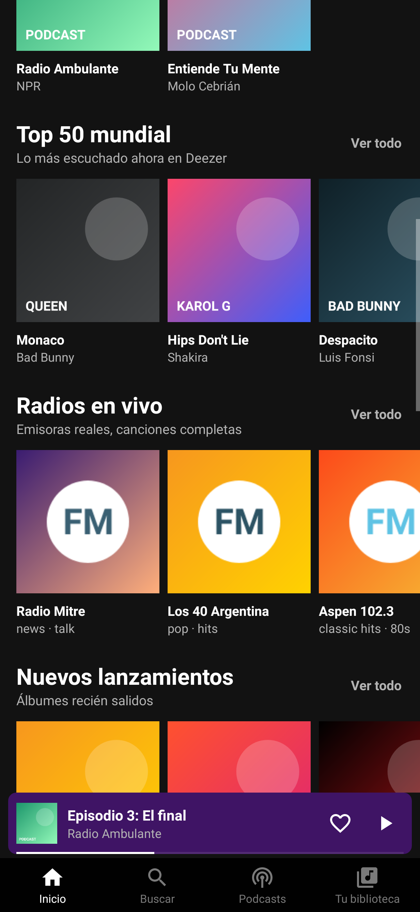
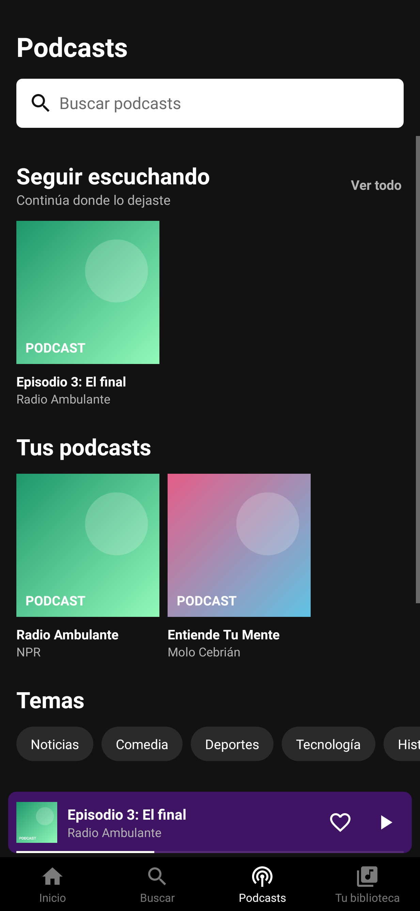
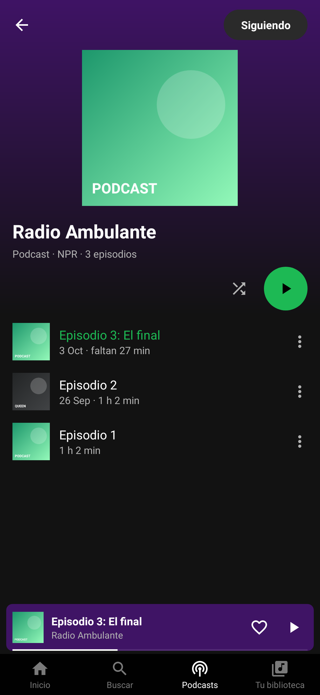
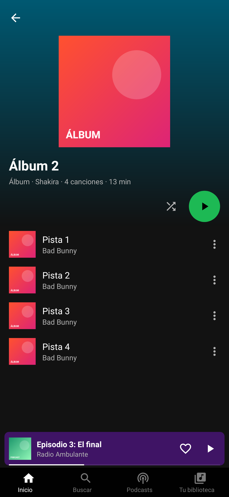

# Sonora — reproductor de música estilo Spotify (Android)

APK listo para instalar: [`dist/Sonora.apk`](dist/Sonora.apk) (v1.6.1, Android 5.0+, ~115 KB).

| Inicio | Podcasts | Un podcast | Álbum | Episodio |
|---|---|---|---|---|
|  |  |  |  |  |

*(Capturas generadas en el simulador con datos de ejemplo; en el teléfono se ven las portadas y listas reales.)*

Hoja de ruta: [`ROADMAP.md`](ROADMAP.md).

## Novedades de la 1.6.1
- **Fandoms y gaming**: estante de artistas de música de internet y de inspiración en videojuegos (The Living Tombstone, CG5, Black Gryph0n, Baasik, NateWantsToBattle, DAGames, TryHardNinja, Rockit Gaming, Miracle Of Sound, Random Encounters, Dan Bull, Griffinilla, Jonathan Young, Jack Stauber) y un estante propio de **The Living Tombstone**. Cada artista se busca por nombre exacto en el catálogo de Deezer; los que no estén se omiten. Se oyen como el resto del catálogo: **vistas previas de 30 s** (la app no incluye archivos de audio). Cualquier otro artista se encuentra con Buscar.

## Novedades de la 1.6 (contenido)
- **Podcasts** (nueva pestaña): populares de tu país (Apple Podcasts), búsqueda, temas, **seguir** programas y **episodios completos** leídos del feed RSS de cada podcast. Se retoma cada episodio donde lo dejaste ("faltan 27 min"), hay una fila "Seguir escuchando" y botones **−15 s / +30 s** en el reproductor. Los enlaces con redirecciones se resuelven antes de reproducir.
- **Álbumes, artistas, playlists y géneros** de Deezer con su propia página: "Nuevos lanzamientos", "Artistas populares", "Playlists populares" y "Géneros" (el top de cada estilo).
- **Muchas más radios**: noticias, deportes, rock, pop, latina, clásica, jazz y electrónica.
- **Más estantes de música**: hip hop, electrónica, jazz, clásica, indie, salsa, bachata, baladas, entrenar, relajarse, fiesta, lo-fi, cumbia y trap.
- Inicio muestra los estantes principales; el resto carga al abrirlo (Buscar → explorar todo). Tus podcasts seguidos están también en Tu biblioteca.

## Novedades de la 1.5
- **Letras sincronizadas** (LRCLIB): la línea que suena se ilumina y la pantalla la sigue; toca una línea para saltar a ella. Si solo hay letra sin tiempos, se muestra completa.
- **Ecualizador**: 10 ajustes (Rock, Pop, Jazz, Clásica, Electrónica, Hip hop, Voz…), una barra por banda de tu dispositivo, refuerzo de graves y sonido envolvente.
- **Temporizador de apagado**: 5 min a 1 hora o "al terminar esta canción"; baja el volumen suavemente antes de parar.
- **Velocidad de reproducción**: 0.5× a 2×.
- **Cola interactiva**: toca para saltar, ✕ para quitar, "Limpiar" para vaciar lo que sigue.
- **Retoma donde lo dejaste**: al abrir la app vuelve la última cola, en pausa y en el mismo segundo.
- **Escuchado recientemente** en Inicio y en la biblioteca, **búsquedas recientes**, **cambiar nombre** de playlists y **compartir** canción.

## Música real
- **Catálogo de Deezer** (API pública, sin cuenta): Top 50 mundial, Reggaetón, Pop latino, Rock en español,
  Cumbia y Trap, más búsqueda de cualquier canción o artista y la página de cada artista con sus éxitos.
  Deezer solo permite **vistas previas de 30 segundos** sin suscripción; los enlaces caducan, así que la app
  pide uno nuevo justo antes de reproducir.
- **Radios en vivo** (radio-browser.info): las emisoras más escuchadas de tu país (según el idioma/país del
  teléfono), con **canciones completas**. También aparecen en la búsqueda.
- Las canciones y radios que marques con ♥ o guardes en playlists se recuerdan aunque reinicies sin internet.

## Qué hace
- **Tu música**: lee las canciones guardadas en el teléfono (MP3, M4A, FLAC…) con portada embebida; se escuchan completas.
- Reproducción en segundo plano con notificación multimedia, pantalla de bloqueo, botones de auriculares/Bluetooth.
- Mini‑reproductor, pantalla completa con barra de progreso, aleatorio, repetir (todo / una), anterior/siguiente.
- ♥ "Canciones que te gustan", playlists propias (crear, añadir, quitar, eliminar), artistas y álbumes.
- Búsqueda instantánea (ignora acentos), "Reproducir a continuación", cola de reproducción.
- Se pausa al desconectar auriculares y respeta llamadas/otras apps (audio focus).

## Compilar
Sin Gradle ni Android Studio: Java puro + herramientas del SDK de Debian/Ubuntu.
```bash
sudo apt install aapt dalvik-exchange zipalign apksigner openjdk-21-jdk-headless
./build.sh            # -> build/Sonora.apk
```
`sonora-release.jks` es la clave de firma (contraseña `sonora123`); conservarla permite instalar futuras versiones encima.

`test/` contiene las pruebas Robolectric (39 casos) con respuestas simuladas de Deezer, radios y LRCLIB (`Fixtures.java`): secciones en línea, reproducción con enlace renovado, radios, búsqueda, playlists, persistencia, sin conexión, todo lo de la 1.5 (temporizador, cola, sesión, historial, letras, ecualizador) y lo de la 1.6 (RSS de podcasts, seguir, progreso por episodio, álbumes, géneros, radios).
