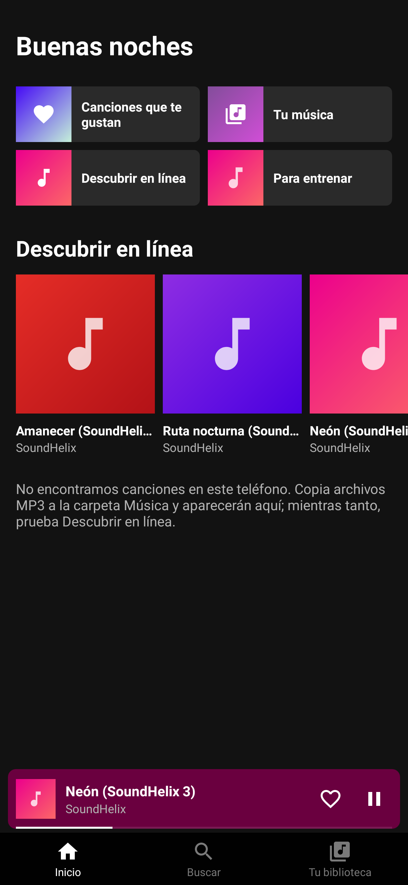
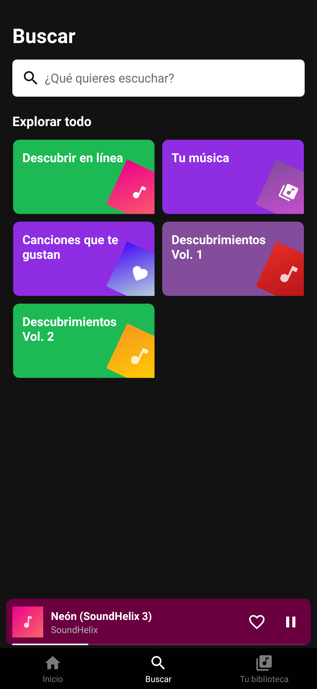
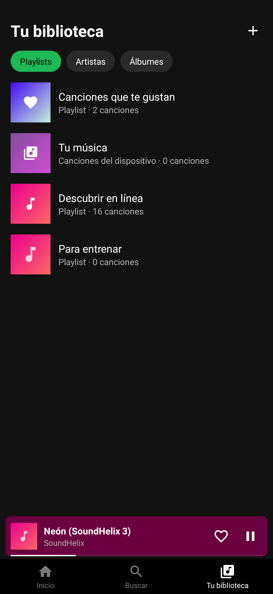

# Sonora — reproductor de música estilo Spotify (Android)

APK listo para instalar: [`dist/Sonora.apk`](dist/Sonora.apk) (Android 5.0+, ~70 KB).

| Inicio | Buscar | Biblioteca | Reproduciendo |
|---|---|---|---|
|  |  |  |  |

## Qué hace
- **Tu música**: lee las canciones guardadas en el teléfono (MP3, M4A, FLAC…) con portada embebida.
- **Descubrir en línea**: 16 temas libres (SoundHelix) que se reproducen por streaming.
- Reproducción en segundo plano con notificación multimedia, pantalla de bloqueo, botones de auriculares/Bluetooth.
- Mini‑reproductor, pantalla completa con barra de progreso, aleatorio, repetir (todo / una), anterior/siguiente.
- ♥ "Canciones que te gustan", playlists propias (crear, añadir, quitar, eliminar), artistas y álbumes.
- Búsqueda instantánea (ignora acentos), "Reproducir a continuación", cola de reproducción.
- Se pausa al desconectar auriculares y respeta llamadas/otras apps (audio focus).

## Compilar
Sin Gradle ni Android Studio: Java puro + herramientas del SDK de Debian/Ubuntu.
```bash
sudo apt install aapt dalvik-exchange zipalign apksigner openjdk-21-jdk-headless
./build.sh            # -> build/Sonora.apk
```
`sonora-release.jks` es la clave de firma (contraseña `sonora123`); conservarla permite instalar futuras versiones encima.

`test/SmokeTest.java` es la prueba Robolectric usada para verificar el flujo completo (abrir, reproducir, notificación, búsqueda, playlists, persistencia).
